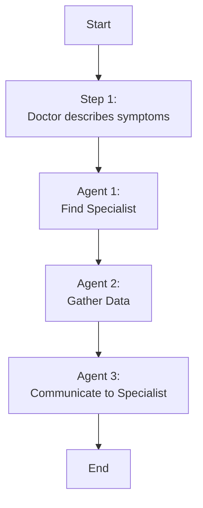

### ReferWell 🩺
Helping family doctors refer their patients to specialists

---
### The Problem

* Lack of personalized matching between patients and specialists
* Inefficient data exchange hindering patient care continuum

---
### Current State

* Overwhelming number of specialists (850+ types) and practitioners (750k)
* Time-consuming research or reliance on word-of-mouth for referrals
* Data silos and manual documentation leading to errors and delays

---
### Market Size

* There are approximately 740MM referrals in the US per year
* The average referral takes ~27 minutes from physician and admins 
* Assuming an average cost of $100/hr, the TAM is $74B per year

---
### Our Solution
1. **Specialist Search**:Finds the most appropriate subspecialty based on the patient's symptoms
2. **Patient Chart Review**: Collect the most relevant data for that specialist from the patient record
3. **Communication Tool**: Generate a letter to the specialist
---

---
### Agent Diagram

---

### Agent Function
- Based on the symptoms, we perform a vector search on the subspecialty descriptors
- Using the patient's location, we find the closest three specialists

---
### Team 🙌
- Bharat
- Omid
- Mick
- _Viraf (transferred)_ 
---

