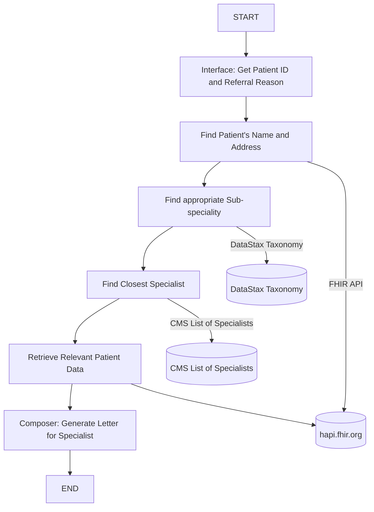

## Background
Doctors routinely refer patients to specialists. In order to make the referral, the doctor needs to collect relevant information from the patient's health record. It further diagnostics are needed, then an order needs to be placed. This work currently involves a lot of manual chart review and data collection. Our goal for this project is to reduce the manual work involved in creating a referral letter. 

#### Current state

The main tasks of the referring physician is to;
- find an appropriate specialist for a given patient defined by their Medical Record Number (MRN) and some input from the doctor as to which type of specialist that patient must visit
- search for an appropriate specialist based on expertise (e.g. oncology, orthopedic), location (e.g. nearest postal code to patient) and existing relationship with the referring doctor 
- understand the relevant data required for the referral letter. This will vary based on the speciality.
- retrieve the required data from the patient record
- (optional) request additional diagnostic exams if needed
- generate letter with the appropriate details

There are many pain points in the process, but we are trying to address the work that is required to match a patient to a specialist and collect the relevant data in order to make a successful referral. 

The matching process is somewhat heuristic and based on the knowledge that the doctors have about know specialists or specialist's facilities. There is no widespread database of specialists that is used in the US or Canada.

Data retrieval can be initiated by referring physician. In larger organizations this may be delegated to a medical assistant, nurse practitioner or other medically trained resource. The time taken to gather the relevant information is dependent on the complexity of the case, the patient's own medical history and the specialist to which the patient is being referred.

[Example Referral Letter](https://www.sahealth.sa.gov.au/wps/wcm/connect/17574169-f2f5-4c96-bc2a-e17385a52940/Cardiology+Referral+Letter.pdf?MOD=AJPERES&amp;CACHEID=ROOTWORKSPACE-17574169-f2f5-4c96-bc2a-e17385a52940-obVto9v)

#### Market Sizing
**In the United States:**

- Approximately 105 million physician office visits result in referrals to specialists annually.
- Primary care physicians spend an average of 74 minutes per day managing referrals, equivalent to about 20% of their clinical time.
- Incomplete referrals are a major issue, with up to 68% of specialists reporting that they receive inadequate information from primary care physicians.

According to a survey by the American Medical Association, physicians spend an average of 16.6 hours per week on administrative tasks, which includes documentation, order entry, and reviewing results. Referral management would be part of these administrative duties.

With over 100 million specialist referrals annually in the US, the scale of this problem is very large. Assuming a $100-$300 per provider/month, the TAM could range from $1 billion to $5 billion annually, depending on adoption rates and service scope.

## Goal
The goal of this work is to develop an Agent flow that helps physicians who have patients that requires a speciality consult. The system will help them find specialists and prepare the documentation for the referral. It will incorporate some information about specialists, data about the patient and be able to generate a referral letter.


## Solution Design
As this is a learning activity, we will be using an agent framework to create this process flow and use a combination of vector search, tool use, human-interrupt and summarization. The flowchart below illustrates the steps in the process.


The user is also asked to confirm the sub-speciality choice and to select the specialist.

There should be the notion that when a list of data features comes back from the FHIR database that the LLM can make the decision, whether there is enough information here to create the referral or it needs to add additional diagnostics.

The state includes:
```jsx

patient_id: str
referrer_details: str
specialty_type: str
specialist_data: str
reason: str
clinical_data: Dict[str,Any]
referral_letter: str

```

### Data

Here are the [Pydantic](https://docs.pydantic.dev/latest/) models for the data that will be used....

## Plan
In the first Sprint of this course, I will be outlining the detailed requirements and solution design. Will be leveraging resources that currently exist as much as possible (e.g https://hapi.fhir.org for test data). 

# Implementation
To run the code, the user must
1. Create a virtual environment. For example, using `python3 -m venv venv`. Activate the environment using `source venv/bin/activate`.
2. Install the dependencies using `pip install -r requirements.txt`.
3. Make a copy of the `.env.example` file and call it `.env`. Open the file and add your API keys into the file.
4. Run the code `chainlit run chainlit_app.py`.
