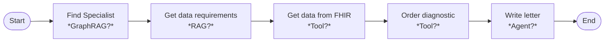

## Overview
Doctors routinely refer patients to specialists. In order to make the referral, the doctor needs to collect relevant information from the patient's health record. It further diagnostics are needed, then an order needs to be placed. This work currently involves a lot of manual chart review and data collection. Our goal for this project is to reduce the manual work involved in creating a referral letter. 

The solution is proposing to automate this process using AI agents. The main tasks of the agents is to;
- find an appropriate specialist for a given patient defined by their Medical Record Number (MRN) and some input from the doctor as to which type of specialist that patient must visit
- search for an appropriate specialist based on expertise (e.g. oncology, orthopedic), location (e.g. nearest postal code to patient) and existing relationship with the referring doctor 
- understand the relevant data required for the referral letter. This will vary based on the speciality.
- retrieve the required data from the patient record
- (optional) request additional diagnostic exams if needed
- generate letter with the appropriate details

As this is a learning activity, we will be using an agent framework to create this process flow and use a combination of RAG, tool use, and summarization. 

## Solution Design
Develop an Agent flow that helps physicians who have patients that requires a speciality consult. The system will help them find specialists and prepare the documentation for the referral. It will incorporate some information about specialists, data about the patient and be able to generate a referral letter.



There should be the notion that when a list of data features comes back from the FHIR database that the LLM can make the decision, whether there is enough information here to create the referral or it needs to add additional diagnostics.

The state should include:

```jsx
{
	"patient": str,
	"referrer": str,
	"specialty": str,
	"specialist": 
	{
		"name" : str,
		"location": str,
		"clinic": str,
	}
}
```

### Data

Here are the [Pydantic](https://docs.pydantic.dev/latest/) models for the data that will be used....

## Steps in the Process
Listed below are the steps that our framework should take in order to create the referral letter for the doctor.

*TBD*

## Plan
In the first Sprint of this course, I will be outlining the detailed requirements and solution design. Will be leveraging resources that currently exist as much as possible (e.g https://hapi.fhir.org for test data). 